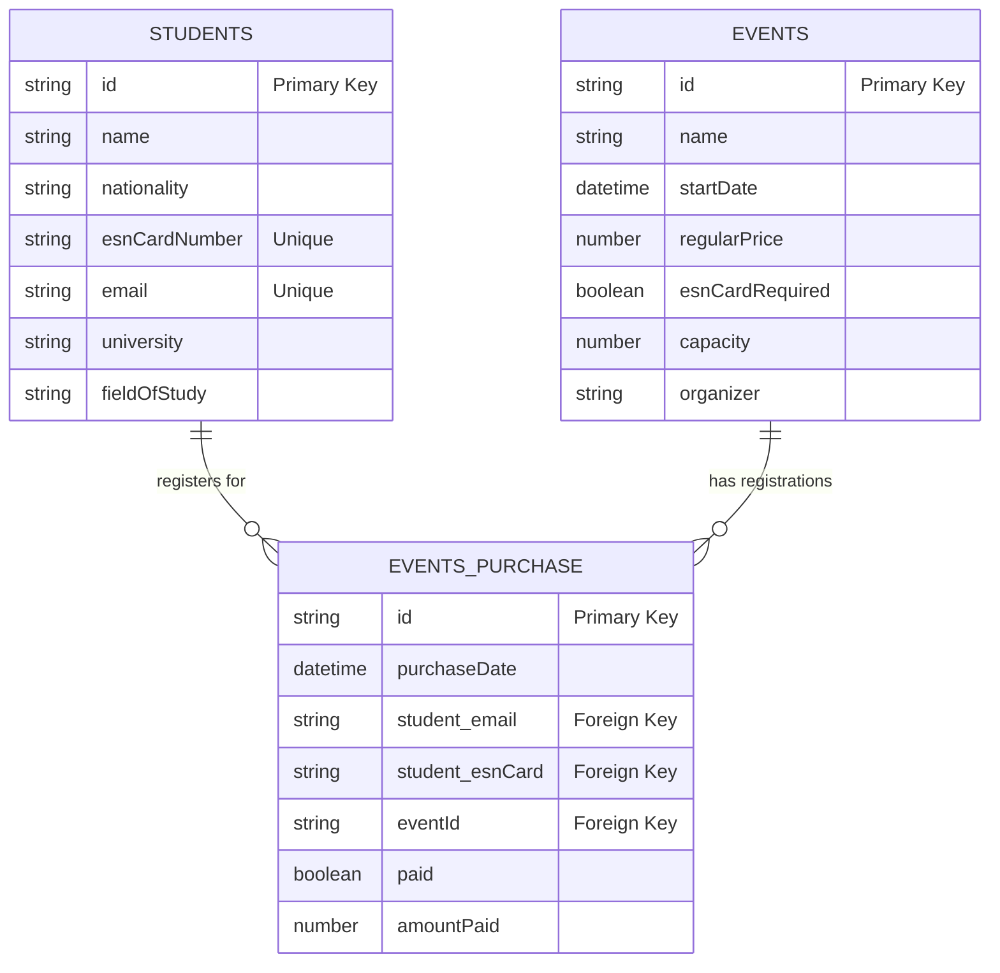

# ESN Porto Database Structure

## Tables Overview

The ESN Porto system consists of three main tables that work together to manage students, events, and event registrations:

## Tables Description

### 1. Students (students.csv)

**Purpose:** Stores information about international students registered with ESN Porto.

**Key Fields:**
- **id**: Unique identifier for each student
- **name**: Student's full name
- **gender**: Student's gender
- **passport**: Passport number/ID
- **email**: Student's email address (unique)
- **phone**: Contact number
- **dateOfBirth**: Student's birth date
- **address**: Current address in Porto
- **nationality**: Country of origin
- **esnCardNumber**: Unique ESN card identification number
- **university**: Host university in Porto
- **fieldOfStudy**: Academic discipline
- **programDuration**: Length of exchange program (e.g., "7-12 months")
- **newsletter**: Whether student opted in for newsletters
- **photos**: Permission for photo usage
- **registerDate**: When the student registered with ESN

**Example Data:** The table contains records like Brazilian student Luana Andrade studying at the University of Porto's Psychology Faculty or Italian student Martina Maurotto at Universidade Fernando Pessoa.

### 2. Events (events.csv)

**Purpose:** Catalogs all events organized by ESN Porto for international students.

**Key Fields:**
- **id**: Unique identifier for each event
- **name**: Event title
- **startDate**: Date and time when the event begins
- **briefDescription**: Short summary of the event
- **description**: Detailed description (often includes HTML formatting)
- **location**: Where the event takes place
- **regularPrice**: Cost in euros (0.0 for free events)
- **esnCardRequired**: Whether an ESN card is needed to participate
- **organizer**: Name of the person organizing the event
- **active**: Whether the event is currently active
- **shared**: If the event is shared with other ESN sections
- **hostInvoicing**: Related to invoicing settings
- **seatsRemaining**: Number of available spots left
- **capacity**: Total number of spots for the event

**Example Data:** Events range from free workshops (Clay Pottery Workshop) to paid activities (Paintball at €18.50) to merchandise sales ("I am home" Socks at €7).

### 3. Events Purchase (events_purchase.csv)

**Purpose:** Junction table that connects students to events, recording all registrations and purchases.

**Key Fields:**
- **id**: Unique transaction identifier
- **purchaseDate**: When the purchase/registration was made
- **student_name**: Name of the student making the purchase
- **student_email**: Email of the student (links to students table)
- **student_esnCard**: ESN card number (links to students table)
- **paid**: Whether payment has been completed
- **amountPaid**: How much was paid
- **vat**: Tax information
- **forceNoTax**: Tax exemption flag
- **usedEsnCard**: Whether ESN card was used for discount
- **shared**: If purchase is shared
- **eventId**: ID of the event being purchased (links to events table)
- **studentEmail**: Redundant field, same as student_email

**Example Data:** Records show students like Tereza Úlehlová paying €80 for an event or Dmytro Prokhach paying €1 for a photo printing service.

## Relationships Between Tables

1. **Students to Events Purchase (One-to-Many)**
   - One student can register for multiple events
   - Each purchase is linked to exactly one student
   - Connections occur through both student_email and student_esnCard fields

2. **Events to Events Purchase (One-to-Many)**
   - One event can have multiple registrations
   - Each purchase is for exactly one event
   - Connected through the eventId field

3. **Students to Events (Many-to-Many)**
   - Students can register for multiple events
   - Events can have multiple students registered
   - This relationship is implemented through the events_purchase junction table

## Business Logic

- ESN Porto organizes various events for international students, ranging from cultural activities to practical services
- Students must register in the system to participate in events
- Some events require ESN card ownership (esnCardRequired flag)
- Events have capacity limits and track remaining seats
- Purchase records maintain financial information for paid events
- The system supports both free and paid activities with various price points

This database structure efficiently supports ESN Porto's mission of enhancing the experience of international students through organized activities and services.# ESN Porto Database Structure

## Tables Overview

The ESN Porto system consists of three main tables that work together to manage students, events, and event registrations:

## Tables Description

### 1. Students (students.csv)

**Purpose:** Stores information about international students registered with ESN Porto.

**Key Fields:**
- **id**: Unique identifier for each student
- **name**: Student's full name
- **gender**: Student's gender
- **passport**: Passport number/ID
- **email**: Student's email address (unique)
- **phone**: Contact number
- **dateOfBirth**: Student's birth date
- **address**: Current address in Porto
- **nationality**: Country of origin
- **esnCardNumber**: Unique ESN card identification number
- **university**: Host university in Porto
- **fieldOfStudy**: Academic discipline
- **programDuration**: Length of exchange program (e.g., "7-12 months")
- **newsletter**: Whether student opted in for newsletters
- **photos**: Permission for photo usage
- **registerDate**: When the student registered with ESN

**Example Data:** The table contains records like Brazilian student Luana Andrade studying at the University of Porto's Psychology Faculty or Italian student Martina Maurotto at Universidade Fernando Pessoa.

### 2. Events (events.csv)

**Purpose:** Catalogs all events organized by ESN Porto for international students.

**Key Fields:**
- **id**: Unique identifier for each event
- **name**: Event title
- **startDate**: Date and time when the event begins
- **briefDescription**: Short summary of the event
- **description**: Detailed description (often includes HTML formatting)
- **location**: Where the event takes place
- **regularPrice**: Cost in euros (0.0 for free events)
- **esnCardRequired**: Whether an ESN card is needed to participate
- **organizer**: Name of the person organizing the event
- **active**: Whether the event is currently active
- **shared**: If the event is shared with other ESN sections
- **hostInvoicing**: Related to invoicing settings
- **seatsRemaining**: Number of available spots left
- **capacity**: Total number of spots for the event

**Example Data:** Events range from free workshops (Clay Pottery Workshop) to paid activities (Paintball at €18.50) to merchandise sales ("I am home" Socks at €7).

### 3. Events Purchase (events_purchase.csv)

**Purpose:** Junction table that connects students to events, recording all registrations and purchases.

**Key Fields:**
- **id**: Unique transaction identifier
- **purchaseDate**: When the purchase/registration was made
- **student_name**: Name of the student making the purchase
- **student_email**: Email of the student (links to students table)
- **student_esnCard**: ESN card number (links to students table)
- **paid**: Whether payment has been completed
- **amountPaid**: How much was paid
- **vat**: Tax information
- **forceNoTax**: Tax exemption flag
- **usedEsnCard**: Whether ESN card was used for discount
- **shared**: If purchase is shared
- **eventId**: ID of the event being purchased (links to events table)
- **studentEmail**: Redundant field, same as student_email

**Example Data:** Records show students like Tereza Úlehlová paying €80 for an event or Dmytro Prokhach paying €1 for a photo printing service.

## Relationships Between Tables

1. **Students to Events Purchase (One-to-Many)**
   - One student can register for multiple events
   - Each purchase is linked to exactly one student
   - Connections occur through both student_email and student_esnCard fields

2. **Events to Events Purchase (One-to-Many)**
   - One event can have multiple registrations
   - Each purchase is for exactly one event
   - Connected through the eventId field

3. **Students to Events (Many-to-Many)**
   - Students can register for multiple events
   - Events can have multiple students registered
   - This relationship is implemented through the events_purchase junction table

## Business Logic

- ESN Porto organizes various events for international students, ranging from cultural activities to practical services
- Students must register in the system to participate in events
- Some events require ESN card ownership (esnCardRequired flag)
- Events have capacity limits and track remaining seats
- Purchase records maintain financial information for paid events
- The system supports both free and paid activities with various price points

This database structure efficiently supports ESN Porto's mission of enhancing the experience of international students through organized activities and services.